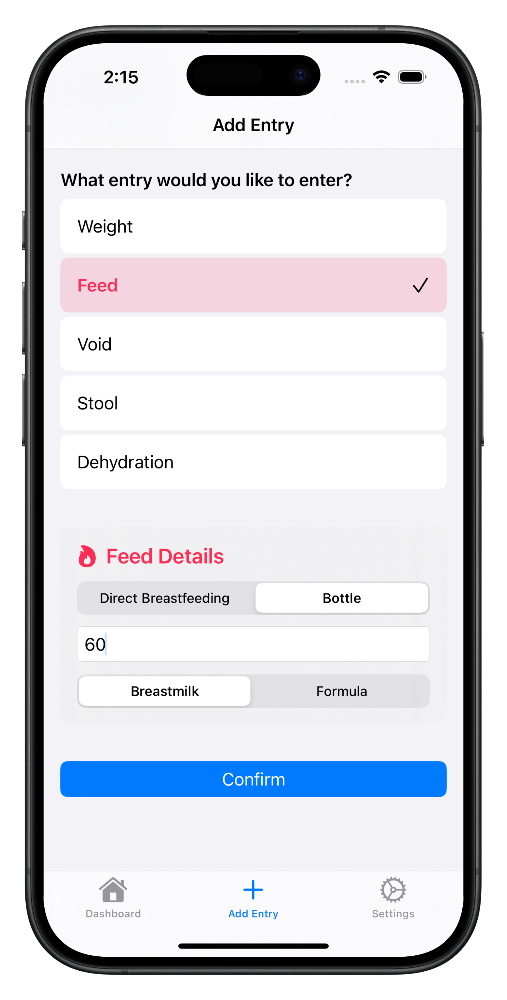

<!--

This source file is part of the Feedbridge based on the Stanford Spezi Template Application project

SPDX-FileCopyrightText: 2025 Stanford University

SPDX-License-Identifier: MIT

-->

# Feedbridge

[](https://github.com/CS342/2025-Feedbridge/actions/workflows/beta-deployment.yml)
[](https://codecov.io/gh/CS342/2025-Feedbridge)
[](https://doi.org/10.5281/zenodo.14740630)


This repository contains the Feedbridge application.
Feedbridge is using the [Spezi](https://github.com/StanfordSpezi/Spezi) ecosystem and builds on top of the [Stanford Spezi Template Application](https://github.com/StanfordSpezi/SpeziTemplateApplication).

> [!TIP]
> Do you want to test the Feedbridge application on your device? [You can downloard it on TestFlight](https://testflight.apple.com/join/Ws5xHBAV).
> 

## Overview

Physiologic poor feeding in newborns, leading to poor weight gain, jaundice, and hospital readmissions, is a significant public health concern. FeedBridge aims to provide personalized, data-driven guidance to parents and physicians, enabling timely intervention and improved newborn outcomes.

| <picture><source media="(prefers-color-scheme: dark)" srcset="assets/1d.png"></picture> | <picture><source media="(prefers-color-scheme: dark)" srcset="assets/2d.png"></picture> | <picture><source media="(prefers-color-scheme: dark)" srcset="assets/3d.png"></picture> |
| :----------------------------------------------------------: | :----------------------------------------------------------: | :----------------------------------------------------------: |
|                    `Dashboard View`                    |                  `Add Entry View`                   |                    `Settings`                     |

## Setup Instructions

You can build and run the application using [Xcode](https://developer.apple.com/xcode/) by opening up the **Feedbridge.xcodeproj**.

The application provides a [Firebase Firestore](https://firebase.google.com/docs/firestore)-based data upload and [Firebase Authentication](https://firebase.google.com/docs/auth) login & sign-up.
It is required to have the [Firebase Emulator Suite](https://firebase.google.com/docs/emulator-suite) to be up and running to use these features to build and test the application locally. Please follow the [installation instructions](https://firebase.google.com/docs/emulator-suite/install_and_configure). 

You do not have to make any modifications to the Firebase configuration, login into the `firebase` CLI using your Google account, or create a project in firebase to run, build, and test the application!

Startup the [Firebase Emulator Suite](https://firebase.google.com/docs/emulator-suite) using
```
$ firebase emulators:start
```

After the emulators have started up, you can run the application in your simulator to build, test, and run the application.


## Feedbridge Features

**Manual Data Entry**

User interface that allows parents to enter and store the following data points:
- Feed Data:
    - Feed date, time, and type (direct breastfeeding vs bottle feeding)
    - Milk type (breastmilk vs formula)
    - Feed time (if type is direct breastfeeding) or feed volume (if type is bottle feeding)
- Wet Diaper Entry:
    - Volume: light, medium, heavy
    - Color: yellow, pink, or red-tinged
    - If pink or red-tinged, alert the parent to seek medical care (may indicate dehydration)
- Stool Entry:
    - Volume: light, medium, heavy
    - Color: Black, dark green, green, brown, yellow, or beige
    - If beige is selected, display an alert to seek medical care (could be a sign of liver failure)
- Dehydration Assessment:
    - Skin elasticity: assess if the skin over the abdomen is stretchy (use visual aids from Dr. Sankar)
    - Dry mucous membranes: check for dry lips and tongue (use visual aids from Dr. Sankar)
    - Alert the parent to seek medical care if either indicator is observed
- Weight Entry:
    - Accepts input in grams, kilograms, or pounds and ounces

**Data Visualization**

The data below are visualized in a graph and timeline format.
- Feeds
    - Trend feed duration/volume and milk type over time.
- Wet Diapers
    - Display diaper quantity and quality (light, medium, heavy, and color) over time.
- Stools
    - Display stool volume and color over time.
- Weights
    - Display one weight point per day (average if multiple weight entries exist in one day).
    - Determine the color of the weight dot based on the risk normogram from [newbornweight.org](https://newbornweight.org/).
    - For high-risk patients, suggest courses of action at home (e.g., triple feeding using visual aids; course mentors can assist in creating this content).
    - Additionally advise high-risk patients to seek medical care.
- Dehydration
    - Displays if baby is dehydrated and gives appropriate warnings

> [!NOTE]  
> Do you want to learn more about the Stanford Spezi Template Application and how to use, extend, and modify the Feedbridge application? Check out the [Stanford Spezi Template Application documentation](https://stanfordspezi.github.io/SpeziTemplateApplication)


## Contributing

Contributions to this project are welcome. Please make sure to read the [contribution guidelines](https://github.com/StanfordSpezi/.github/blob/main/CONTRIBUTING.md) and the [contributor covenant code of conduct](https://github.com/StanfordSpezi/.github/blob/main/CODE_OF_CONDUCT.md) first.


## License

This project is licensed under the MIT License. See [Licenses](LICENSES) for more information.


